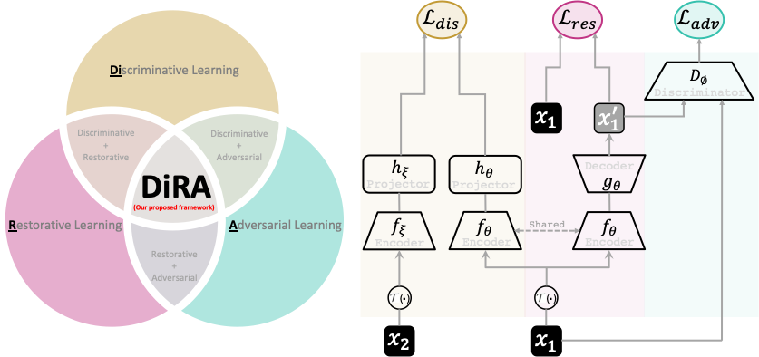
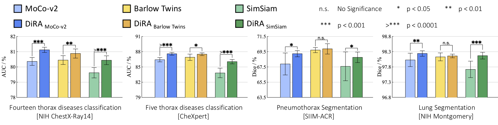
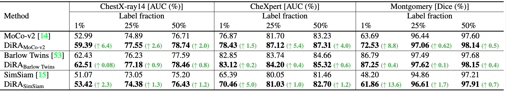
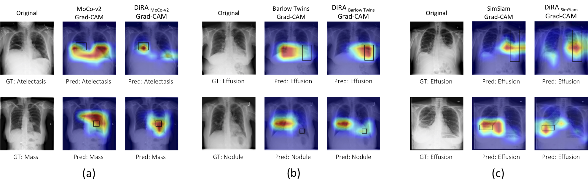
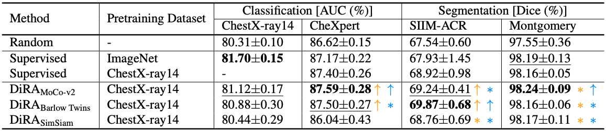

# [CVPR'2022] DiRA: Discriminative, Restorative, and Adversarial Learning for Self-supervised Medical Image Analysis

This repository provides a PyTorch implementation of the [DiRA: Discriminative, Restorative, and Adversarial Learning for Self-supervised Medical Image Analysis]() which is published in [CVPR](https://cvpr2022.thecvf.com/) 2022 (main conference).

Discriminative learning, restorative learning, and adversarial learning have proven beneficial for self-supervised learning schemes in computer vision and medical imaging. Existing efforts, however, omit their synergistic effects on each other in a ternary setup, which, we envision, can significantly benefit deep semantic representation learning. To realize this vision, we have developed DiRA, the first framework that unites discriminative, restorative, and adversarial learning in a unified manner to collaboratively glean complementary visual information from unlabeled medical images for fine-grained semantic representation learning. 

<br/>
<p align="center"></p>
<br/>

## Publication
<b>DiRA: Discriminative, Restorative, and Adversarial Learning for Self-supervised Medical Image Analysis </b> <br/>
[Fatemeh Haghighi](https://github.com/fhaghighi)<sup>1*</sup>, [Mohammad Reza Hosseinzadeh Taher](https://github.com/MR-HosseinzadehTaher)<sup>1*</sup>,  [Michael B. Gotway](https://www.mayoclinic.org/biographies/gotway-michael-b-m-d/bio-20055566)<sup>2</sup>, [Jianming Liang](https://chs.asu.edu/jianming-liang)<sup>1</sup><br/>
<sup>1 </sup>Arizona State University, <sup>2 </sup>Mayo Clinic <br/>
<sup>*</sup> Equal contributors ordered alphabetically.<br/>
Published in: **IEEE/CVF Conference on Computer Vision and Pattern Recognition (CVPR), 2022.**


[Paper](#) | [Code](#) | [Poster](#) | [Slides](#) | Presentation ([YouTube](#), [YouKu](#))

## Major results from our work
1. **DiRA enriches discriminative learning.**
<br/>
<p align="center"></p>
<br/>

2. **DiRA improves robustness to small data regimes.**
<br/>
<p align="center"></p>
<br/>

3. **DiRA improves weakly-supervised localization.**
<br/>
<p align="center"></p>

4. **DiRA outperforms fully-supervised baselines.**
<br/>
<p align="center"></p>
<br/>

Credit to [superbar](https://github.com/scottclowe/superbar) by Scott Lowe for Matlab code of superbar.

## Requirements
+ Linux
+ Python
+ Install PyTorch ([pytorch.org](http://pytorch.org))

## Installation
Clone the repository and install dependencies using the following command:
```bash
$ git clone https://github.com/fhaghighi/DiRA.git
$ cd DiRA/
$ pip install -r requirements.txt
```

## Self-supervised pre-training
### 1. Preparing data
We used traing set of ChestX-ray14 dataset for pre-training 2D DiRA models, which can be downloaded from [this link](https://nihcc.app.box.com/v/ChestXray-NIHCC).

- The downloaded ChestX-ray14 should have a directory structure as follows:
```
ChestX-ray14/
    |--  images/ 
         |-- 00000012_000.png
         |-- 00000017_002.png
         ... 
```
We use 10% of training data for validation. We also provide the list of training and validation images in ``dataset/Xray14_train_official.txt`` and ``dataset/Xray14_val_official.txt``, respectively. The training set is based on the officiall split provided by ChestX-ray14 dataset. Training labels are not used during pre-training stage. The path to images folder is required for pre-training stage.

### 2. Pre-training DiRA
This implementation only supports multi-gpu, DistributedDataParallel training, which is faster and simpler; single-gpu or DataParallel training is not supported. The instance discrimination setup follows [MoCo](https://github.com/facebookresearch/moco). The checkpoints with the lowest validation loss are used for fine-tuning. We do unsupervised pre-training of a U-Net model with ResNet-50 backbone on ChestX-ray14 using 4 NVIDIA V100 GPUs.

To stabilize the adversarial training process, we first warm up the encoder and decoder by training the discriminative and restorative components. To do so, run the following command:
```bash
python main_DiRA_moco.py /path/to/images/folder --dist-url 'tcp://localhost:10001' --multiprocessing-distributed \
--world-size 1 --rank 0 --mlp --moco-t 0.2  --cos --mode dir 
```
Next, we add the adversarial learning to jointly train the whole framework. To do so, run the following command:
```bash
python main_DiRA_moco.py /path/to/images/folder --dist-url 'tcp://localhost:10001' --multiprocessing-distributed \
--world-size 1 --rank 0 --mlp --moco-t 0.2  --cos --mode dira --batch-size 16   --epochs 400 --generator_pre_trained_weights checkpoint/DiRA_moco/dir/checkpoint.pth 
```

## Fine-tuning on downstream tasks
For downstream tasks, we use the code provided by recent [transfer learning benchmark](https://github.com/MR-HosseinzadehTaher/BenchmarkTransferLearning) in medical imaging. 

DiRA provides a pre-trained U-Net model, which the encoder can be utilized for the <i>classification</i> and encoder-decoder for the  <i>segmentation</i> downstream tasks. 

For classification tasks, a ResNet-50 encoder can be initialized with the pre-trained encoder of DiRA as follows:
```python
import torchvision.models as models

num_classes = #number of target task classes
weight = #path to DiRA pre-trained model
model = models.__dict__['resnet50'](num_classes=num_classes)
state_dict = torch.load(weight, map_location="cpu")
if "state_dict" in state_dict:
   state_dict = state_dict["state_dict"]
state_dict = {k.replace("module.", ""): v for k, v in state_dict.items()}
state_dict = {k.replace("backbone.", ""): v for k, v in state_dict.items()}
state_dict = {k.replace("encoder.", ""): v for k, v in state_dict.items()}
for k in list(state_dict.keys()):
   if k.startswith('fc') or k.startswith('segmentation_head') or k.startswith('decoder') :
      del state_dict[k]
msg = model.load_state_dict(state_dict, strict=False)
print("=> loaded pre-trained model '{}'".format(weight))
print("missing keys:", msg.missing_keys)
```

For segmentation tasks, a U-Net can be initialized with the pre-trained encoder and decoder of DiRA as follows:
```python
import segmentation_models_pytorch as smp

backbone = 'resnet50'
weight = #path to DiRA pre-trained model
model=smp.Unet(backbone)
state_dict = torch.load(weight, map_location="cpu")
if "state_dict" in state_dict:
   state_dict = state_dict["state_dict"]
state_dict = {k.replace("module.", ""): v for k, v in state_dict.items()}
state_dict = {k.replace("backbone.", ""): v for k, v in state_dict.items()}
for k in list(state_dict.keys()):
   if k.startswith('fc') or k.startswith('segmentation_head'):
      del state_dict[k]
msg = model.load_state_dict(state_dict, strict=False)
print("=> loaded pre-trained model '{}'".format(weight))
print("missing keys:", msg.missing_keys)

```


## Citation
If you use this code or use our pre-trained weights for your research, please cite our paper:
```
```
## Acknowledgement
With the help of Zongwei Zhou, Zuwei Guo started implementing the earlier ideas behind ``United & Unified'', which has branched out into DiRA. We thank them for their feasibility exploration, especially their initial evaluation on TransVW and various training strategies. This research has been supported in part by ASU and Mayo Clinic through a Seed Grant and an Innovation Grant and in part by the NIH under Award Number R01HL128785. The content is solely the responsibility of the authors and does not necessarily represent the official views of the NIH. This work  utilized the GPUs provided in part by the ASU Research Computing and in part by the Extreme Science and Engineering Discovery Environment (XSEDE) funded by the National Science Foundation (NSF) under grant number ACI-1548562.  Paper content is covered by patents pending. We build U-Net architecture for segmentation tasks by referring to the released code at [segmentation_models.pytorch](https://github.com/qubvel/segmentation_models.pytorch). The instance discrimination is based on [MoCo](https://github.com/facebookresearch/moco).


## License

Released under the [ASU GitHub Project License](./LICENSE).
